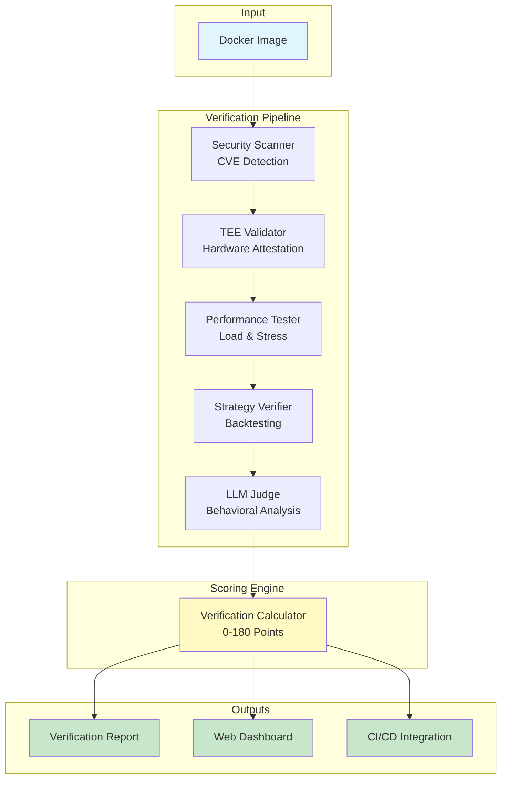

# Arc-Verifier

Open source verification infrastructure for autonomous agents across agentic protocols. The industry standard for comprehensive security validation, behavioral verification, and performance certification of AI agents that manage real assets.

## Overview

Arc-Verifier provides automated evaluation of autonomous agents deployed on agentic protocols including multichain intent systems, and TEE-based infrastructures. As autonomous agents increasingly manage billions in capital and execute decisions without human intervention, verification becomes critical for protocol safety and user trust.

### Key Features

- **Security Validation**: Container scanning, TEE attestation, key management verification
- **Strategy Verification**: Validates agents do what they claim with real market data
- **Verification Score™**: Trustworthiness metric (0-180)
- **Production Scale**: Verify 100+ agents in parallel
- **LLM-as-a-Judge**: Agent behavioral assessment and risk detection
- **Protocol Agnostic**: Works with any containerized agent

## Architecture Diagram



### Component Architecture

```
arc-verifier/
├── core/                 # Core verification engine
│   ├── verifier.py      # Main orchestrator
│   └── pipeline.py      # Pipeline coordination
├── security/            # Security components
│   ├── scanner.py       # Vulnerability scanning
│   └── tee_validator.py # TEE attestation
├── analysis/            # Analysis engines
│   ├── performance.py   # Load testing
│   ├── strategy.py      # Strategy verification
│   └── llm_judge/       # AI behavioral analysis
├── data/                # Market data management
│   ├── backtester.py    # Historical testing
│   └── fetcher.py       # Data collection
├── orchestration/       # Scaling infrastructure
│   └── parallel.py      # Concurrent verification
├── web/                 # Web UI dashboard
│   ├── templates/       # HTML templates
│   └── static/          # CSS/JS assets
└── cli/                 # Command-line interface
    └── commands/        # CLI commands
```

## Architecture

### Core Components

| Component | Purpose |
|-----------|---------|
| `scanner.py` | Container vulnerability detection using Trivy |
| `validator.py` | TEE attestation validation (Intel SGX, AMD SEV) |
| `benchmarker.py` | Performance testing and resource profiling |
| `strategy_verifier.py` | Trading strategy analysis with real market data |
| `real_backtester.py` | Historical performance simulation |
| `simulator.py` | Agent behavior simulation under various conditions |
| `llm_judge/` | AI-based code analysis and behavioral assessment |
| `tee/` | Trusted Execution Environment validation suite |
| `parallel_verifier.py` | Concurrent verification using Dagger orchestration |
| `verification_pipeline.py` | End-to-end verification workflow coordination |

### LLM Judge Module

Modular AI analysis system for trust-focused evaluation:

```
llm_judge/
├── core.py              # Main orchestrator
├── models.py            # Pydantic data models
├── providers/           # LLM provider abstractions
│   ├── anthropic.py     # Anthropic Claude integration
│   ├── openai.py        # OpenAI GPT integration
│   └── factory.py       # Provider selection logic
├── security/            # Trust-focused analysis
│   ├── analyzers.py     # Security pattern detection
│   ├── prompts.py       # Security evaluation prompts
│   └── scoring.py       # Trust score calculation
└── evaluation/          # General assessment
    ├── ensemble.py      # Multi-provider evaluation
    └── prompts.py       # Behavioral analysis prompts
```

### TEE Validation Suite

Hardware-based verification for trusted execution:

```
tee/
├── attestation_verifier.py    # Attestation validation
├── phala_validator.py         # Phala Network TEE support
├── code_hash_registry.py      # Verified code tracking
└── config.py                  # TEE configuration management
```

## Verification Pipeline

Five-stage automated analysis:

```
Docker Image → Security Scan → TEE Validation → Performance Test → Strategy Analysis → AI Assessment → Score
```

1. **Security Analysis** (`scanner.py`)
   - CVE detection with Trivy
   - Dependency vulnerability assessment
   - Container configuration analysis

2. **TEE Attestation** (`validator.py`, `tee/`)
   - Hardware security validation
   - Enclave measurement verification
   - Code integrity confirmation

3. **Performance Evaluation** (`benchmarker.py`)
   - Load testing and throughput measurement
   - Resource usage profiling
   - Latency analysis under stress

4. **Strategy Verification** (`strategy_verifier.py`, `real_backtester.py`)
   - Historical performance backtesting
   - Market regime analysis
   - Risk-adjusted return calculation

5. **Behavioral Assessment** (`llm_judge/`, `simulator.py`)
   - AI-powered code review
   - Intent classification and validation
   - Deception and malicious pattern detection

## Quick Start

### Installation

```bash
# Install from PyPI
pip install arc-verifier

# Install with all features
pip install 'arc-verifier[llm,web]'

# Initialize environment
arc-verifier init
```

### Basic Usage

```bash
# Verify single agent
arc-verifier verify myagent:latest

# Verify with high security requirements
arc-verifier verify prod-agent:latest --tier high

# Batch verification from file
arc-verifier batch -f agents.txt --max-concurrent 20

# Launch web dashboard
arc-verifier export web
```

### Programmatic API

```python
from arc_verifier import api

# Simple verification
result = await api.verify_agent("myagent:latest")
print(f"Fort Score: {result.fort_score}/180")
print(f"Status: {result.status}")

# Batch verification with custom settings
results = await api.verify_batch(
    ["agent1:latest", "agent2:latest", "agent3:latest"],
    max_concurrent=10,
    enable_llm=True,
    tier="high"
)

# Access individual components
security_result = await api.scan_security("myagent:latest")
performance_result = await api.test_performance("myagent:latest", duration=120)
backtest_result = await api.backtest_strategy("trader:latest", start_date="2024-01-01")
```

## Configuration

### Environment Variables

```bash
# LLM Analysis
ANTHROPIC_API_KEY=your_key
OPENAI_API_KEY=your_key
LLM_PRIMARY_PROVIDER=anthropic
LLM_ENABLE_ENSEMBLE=true

# TEE Validation
TEE_INTEL_PCCS_ENDPOINT=https://api.trustedservices.intel.com/sgx/certification/v4
TEE_PHALA_ENDPOINT=https://api.phala.network/v1/verify

# Performance Testing
BENCHMARK_DURATION=60
DOCKER_TIMEOUT=30
```

### TEE Configuration

```bash
# Initialize TEE configuration
python -m arc_verifier.tee.cli init-config

# Add agent to registry
python -m arc_verifier.tee.cli registry add myagent:latest \
  --risk-level medium --capabilities "trading,defi"
```

## Output Formats

### Terminal Output
```
┌──────────────────────────────┐
│     Verification Results     │
├──────────────────────────────┤
│ Security: ✓ 0 critical      │
│ TEE: ✓ Intel SGX verified   │
│ Performance: ✓ 2000 TPS     │
│ Strategy: ✓ 75% effective   │
│ AI Analysis: ✓ No risks     │
└──────────────────────────────┘

Fort Score: 145/180 (Deploy with confidence)
```

### JSON Output
```json
{
  "verification_id": "ver_a1b2c3d4",
  "image": "myagent:latest",
  "timestamp": "2024-01-15T10:30:00Z",
  "fort_score": 145,
  "components": {
    "docker_scan": {
      "vulnerabilities": {"critical": 0, "high": 0},
      "agent_detected": true
    },
    "tee_validation": {
      "valid": true,
      "platform": "Intel SGX",
      "measurements": {"mrenclave": "abc123..."}
    },
    "performance": {
      "throughput": 2000,
      "latency_p99": 45.7,
      "cpu_efficiency": 0.85
    },
    "strategy_analysis": {
      "detected_strategy": "arbitrage",
      "effectiveness": 75.2,
      "max_drawdown": 0.12
    },
    "llm_analysis": {
      "trust_recommendation": "DEPLOY",
      "confidence": 0.92,
      "risk_score": 0.15
    }
  }
}
```

## CI/CD Integration

### GitHub Actions
```yaml
- name: Verify Agent
  run: |
    pip install arc-verifier
    arc-verifier verify ${{ github.repository }}:${{ github.sha }} \
      --tier high --output json > results.json
    
    # Enforce minimum score
    SCORE=$(jq -r '.fort_score' results.json)
    if [ $SCORE -lt 120 ]; then exit 1; fi
```

### Integration with Agentic Protocols

Arc-Verifier integrates with various agentic protocol infrastructures:

- **Intent-based Systems**: Validate agents executing cross-chain intents
- **TEE-based Protocols**: Comprehensive attestation for Phala, Oasis, and other TEE networks
- **General Agent Frameworks**: Protocol-agnostic verification for any containerized agent

## Fort Score™

The industry-standard trustworthiness metric for autonomous agents (0-180 points):

### Scoring Components

| Component | Range | Evaluation Criteria |
|-----------|-------|-------------------|
| **Security** | -30 to +30 | • Vulnerability count and severity<br>• Secure coding practices<br>• Key management security<br>• TEE attestation validity |
| **Performance** | -50 to +90 | • Throughput and latency<br>• Resource efficiency<br>• Error handling<br>• Scalability under load |
| **Strategy** | -30 to +30 | • Backtesting performance<br>• Risk-adjusted returns<br>• Strategy consistency<br>• Market regime adaptability |
| **Intelligence** | -30 to +30 | • LLM behavioral analysis<br>• Code quality assessment<br>• Malicious pattern detection<br>• Trust recommendations |

### Deployment Guidelines

| Score Range | Status | Recommendation |
|------------|---------|----------------|
| **150-180** | 🟢 Excellent | Deploy to production with confidence |
| **120-149** | 🟡 Good | Deploy with monitoring, minor improvements recommended |
| **90-119** | 🟠 Fair | Deploy to staging only, significant improvements needed |
| **60-89** | 🔴 Poor | Do not deploy, major issues present |
| **0-59** | ⛔ Critical | High risk, fundamental redesign required |

### Export Options

Export verification results in various formats:

```bash
# Export as HTML report
arc-verifier export results --latest --format html

# Export as JSON
arc-verifier export results --latest --format json

# View in web dashboard
arc-verifier export web
```

## Data Sources

Arc-Verifier automatically collects:

| Source | Data | Components |
|--------|------|------------|
| Container Image | Layers, dependencies, configuration | `scanner.py` |
| Runtime Metrics | Resource usage, performance data | `benchmarker.py` |
| Market Data | Historical prices, volatility | `data_fetcher.py`, `data_registry.py` |
| TEE Attestations | Hardware measurements, signatures | `tee/` |
| Code Patterns | Logic analysis, behavioral signatures | `llm_judge/` |

## Current Capabilities

### 🔐 Security Validation
- Container vulnerability scanning with Trivy
- TEE attestation validation (simulation mode)
- Dependency vulnerability assessment
- Security scoring based on CVE severity

### 📊 Strategy Analysis
- Historical backtesting with real market data
- Strategy type detection (arbitrage, market making, momentum)
- Risk metrics calculation
- Performance effectiveness scoring

### ⚡ Parallel Verification
- Concurrent agent verification using asyncio
- Resource-aware semaphore management
- Batch processing with progress tracking
- Configurable concurrency limits

### 🌐 Web Dashboard
- Interactive verification history viewer
- Fort Score visualization and trends
- Component metrics breakdown
- Real-time statistics dashboard

### 🤖 LLM Analysis
- Multi-provider support (Anthropic, OpenAI)
- Security-focused code analysis
- Behavioral pattern detection
- Trust scoring and recommendations

## Installation

```bash
# Requirements: Python 3.11+, Docker
pip install arc-verifier

# With all features
pip install 'arc-verifier[llm,web]'

# Development installation
git clone https://github.com/arc-computer/arc-verifier
cd arc-verifier
pip install -e ".[dev,llm,web]"
```

## Contributing

Open source infrastructure project. See `CONTRIBUTING.md` for development guidelines.

- **Issues**: GitHub Issues for bug reports
- **Development**: Follow conventional commits, maintain test coverage
- **Documentation**: Update relevant component docs with changes

## License

MIT License - Open source infrastructure for the agentic protocol ecosystem.

---

**Verification infrastructure for autonomous agents across all agentic protocols**
